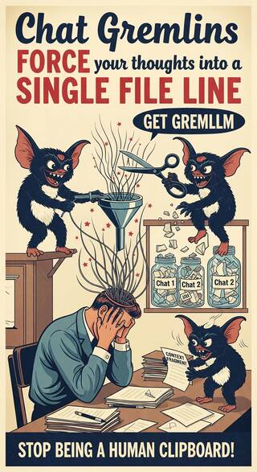

# Gremllm - An Experimental IDE (Idea Development Environment)



A desktop chat app for AI-assisted thinking, built with ClojureScript and Electron.

## What's this?

I'm building a tool I want to use myself - a better way to think deeply with AI assistance. The main idea is to organize chats into topics that can branch and maintain context, rather than having one long linear thread.

Right now it's just a basic chat interface. The branching features aren't built yet.

## Current Status

Not useful yet.

**What works:**
- Chat with Claude 4.x, GPT-5, or Gemini 2.5
- Basic desktop app with Electron
- Message history during a session

**What's planned:**
- Branching conversations into subtopics
- Context inheritance between topics
- Saving and loading projects
- Support for other AI providers

## Running it

You'll need Node.js 22+, Java 21+, and Clojure installed .

```bash
npm install

# Run tests
npm run test

# Set up your API key
cp .env_example .env
# Edit .env and add your Anthropic API key

# Encrypt your .env file (creates .env.keys)
npx dotenvx encrypt

# Run in dev mode (will use the encrypted vault)
npm run dev
```

Dev mode automatically starts [Dataspex](https://github.com/cjohansen/dataspex) for state inspection. The UI opens at http://localhost:7117 where you can observe Nexus state changes and action flow in real-time.

## Maintenance

```bash
# Check for outdated Clojure dependencies
clj -M:outdated

# Update npm packages
npm update
```

## Tech

- Electron for the desktop app
- ClojureScript
- Replicant for UI
- Nexus for state management

## Contributing

Feel free to open issues or PRs if you find it useful. No promises on response time - I work on this when I have time.

## License

MIT
