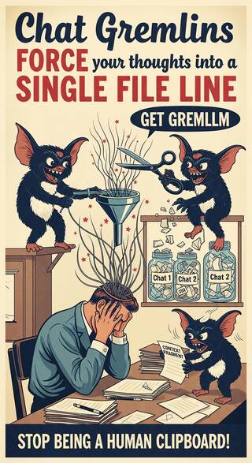

# Gremllm — an Idea Development Environment



**Slow thinking with AI.**

Gremllm is a desktop workspace for working on high-value documents with AI — investment memos, strategy docs, product requirements. Documents that carry your name, get scrutinized, and usually take several experts to produce.

You edit a single `document.md`. An AI assistant proposes tracked changes, and you accept or reject each one. To steer it, select text in the document and stage it as context for your next prompt. The artifact stays yours; the AI helps you think.

## Status

Early. Not ready for real work.

**Today:**
- Document panel with live markdown rendering
- AI assistant via the Agent Client Protocol (Claude, through `claude-agent-acp`)
- Pending diffs appear inline with accept/reject controls
- Selected text stages as structured context for the next prompt
- Workspaces are portable folders — files on disk, not a database

**Next:**
- Quick-action agents: launch a purpose-built topic from a selection (validate, research, simplify)

## Try it on macOS

Download the `.dmg` from the latest successful run on the [Actions tab](https://github.com/Quantisan/gremllm/actions/workflows/release-macos.yml). After downloading with Safari, remove quarantine before first launch:

```bash
xattr -dr com.apple.quarantine Gremllm.app
```

## Run from source

Requires Node.js 22+, Java 21+, and Clojure.

```bash
npm install
npm run dev      # hot reload; Dataspex state inspector at localhost:7117
npm test         # unit tests
npm run test:integration   # requires API keys
```

## Tech

Electron, ClojureScript, [Replicant](https://github.com/cjohansen/replicant) (UI), [Nexus](https://github.com/cjohansen/nexus) (state), [Agent Client Protocol](https://agentclientprotocol.com/) (AI integration).

## Contributing

Issues and PRs welcome. No promises on response time — this is a side project.

## License

MIT
